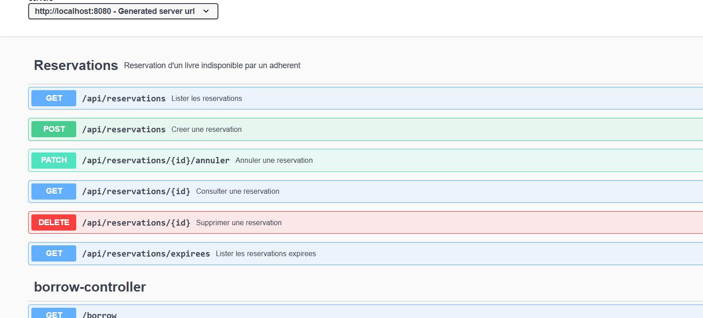

# Séance 2 — Module Réservation

> **Branche :** `feature/reservation-tasse-ulruch` → `main`
> **Contenu de ce fichier :** à coller tel quel dans la description de la Pull Request.

---

## Ce que fait cette PR

Un adhérent peut réserver un livre **indisponible** et sera prévenu quand un exemplaire revient.
Le module suit le découpage du projet existant — entité, repository, service, contrôleur — avec
un DTO en entrée et un DTO en sortie. **Aucune logique métier dans le contrôleur**, et l'entité
`Reservation` ne sort jamais du service : `ReservationService.versDto()` est son unique porte de
sortie.

## Les cinq endpoints

| Verbe | Chemin | Succès | Erreurs |
|---|---|---|---|
| `POST` | `/api/reservations` | 201 | 400, 404, 409 |
| `GET` | `/api/reservations` | 200 | 400 *(statut inconnu)* |
| `GET` | `/api/reservations/{id}` | 200 | 404 |
| `PATCH` | `/api/reservations/{id}/annuler` | 200 | 404, 409 |
| `DELETE` | `/api/reservations/{id}` | 204 | 404 |

Le client n'envoie que `livreId` et `adherentId`. La date de réservation, la date d'expiration
et le statut initial sont déterminés par le serveur.

**Bonus :** `GET /api/reservations/expirees`, et bascule automatique en `EXPIREE`.

## Capture Swagger



## Où chaque règle est implémentée

Les emplacements renvoient à `bibliotheque-backend/src/main/java/com/ibizabroker/bibliotheque/`.

| Réf. | Une phrase | Emplacement |
|---|---|---|
| **RG-01** | Le service refuse la création si `noOfCopies > 0` : un livre encore en rayon s'emprunte, il ne se réserve pas. | `service/ReservationService.java` — test L73, prédicat `estDisponible()` L236 |
| **RG-02** | Avant de créer, le service demande au repository s'il existe déjà une réservation **active** de cet adhérent sur ce livre. | `service/ReservationService.java` L81-82, requête `existsByAdherentUserIdAndLivreBookIdAndStatutIn` |
| **RG-03** | Le service compte les réservations actives de l'adhérent et refuse la quatrième. | `service/ReservationService.java` L90-96, constante `MAX_RESERVATIONS_ACTIVES = 3` L39 |
| **RG-04** | `dateExpiration = dateReservation + 7 jours`, à partir d'un **unique** appel à `LocalDateTime.now()` côté serveur. | `service/ReservationService.java` L107-109, constante `Reservation.DUREE_VALIDITE_JOURS` |
| **RG-05** | L'annulation n'est acceptée que si le statut courant est actif, c'est-à-dire `EN_ATTENTE` ou `DISPONIBLE`. | `service/ReservationService.java` — `annuler()` L173, garde L177 |
| **RG-06** | Les trois statuts terminaux sont déclarés dans l'énumération et consultés partout où un état change : à l'annulation, et par le balayage d'expiration qui ne cible que les réservations actives. | `entity/StatutReservation.java` — `estActif()` / `estTerminal()`, consommés L177 (annulation) et L208 (expiration) |

> La définition de « réservation active » n'est écrite **qu'une fois**, dans
> `StatutReservation.ACTIFS`. RG-02, RG-03 et le balayage d'expiration s'y réfèrent tous les
> trois : la règle ne peut pas diverger d'un point d'appel à l'autre.

## Gestion des erreurs

`ReservationExceptionHandler` traduit les exceptions en réponses HTTP au format unique `ApiError` :

```json
{
  "timestamp": "2026-08-27T19:14:02",
  "status": 409,
  "error": "Conflict",
  "message": "RG-03 : l'adherent a2_quota a deja 3 reservation(s) active(s), le maximum autorise est 3.",
  "regle": "RG-03"
}
```

La référence de la règle est un **champ à part** et pas seulement du texte : un client peut réagir
à `RG-03` sans analyser une chaîne de caractères.

> L'advice est volontairement limité à `ReservationController` (`assignableTypes`). Un advice
> global aurait changé le corps des erreurs déjà renvoyées par `AdminController`, `BooksController`
> et `BorrowController`, sur lesquelles le frontend Angular s'appuie déjà.

## Modifications de l'existant

Trois fichiers déjà présents ont dû bouger. Chacune de ces modifications est **nécessaire au
module**, aucune n'est cosmétique.

| Fichier | Modification | Pourquoi |
|---|---|---|
| `pom.xml` | `spring-boot-starter-validation` | Depuis Spring Boot 2.3, `starter-web` n'embarque plus Bean Validation. Sans lui, les `@NotNull` seraient **ignorés en silence** et le 400 exigé n'existerait pas. |
| `pom.xml` | `springdoc-openapi-ui` 1.5.13 | Swagger, exigé par l'énoncé. Branche 1.5.x : la dernière qui cible `javax`, comme le reste du projet. |
| `pom.xml` | `lombok.version` → 1.18.30 | La 1.18.20 héritée du parent casse la compilation sur **tout JDK 21**. Lombok n'agit qu'à la compilation ; la cible reste le bytecode Java 8. |
| `pom.xml` | `h2` en portée test | Permet de vérifier le module sans MySQL ni Docker. N'entre pas dans le jar livré. |
| `WebSecurityConfiguration` | `/api/reservations/**` et les chemins Swagger en `permitAll` | Sans cela, `/swagger-ui.html` répond **401** et la documentation exigée est inaccessible. Même politique que `/borrow/**`, l'autre module tourné vers l'adhérent ; les codes attendus par l'énoncé (400/404/409) n'incluent pas 401. |
| `CorsConfiguration` | `PATCH` ajouté aux méthodes autorisées | La liste était explicite (`GET, POST, PUT, DELETE`). `PATCH` était rejeté au *preflight* : l'annulation aurait fonctionné depuis curl et Swagger, mais **pas depuis le navigateur**. |

## Tests — 26, tous verts

```
Tests run: 26, Failures: 0, Errors: 0, Skipped: 0
BUILD SUCCESS
```

| Classe | Nb | Portée |
|---|---|---|
| `ReservationServiceTest` | 10 | Chaque règle RG-01 à RG-06, avec Mockito, sans base ni serveur |
| `ReservationControllerTest` | 15 | Les cinq endpoints de bout en bout sur H2 : 201, 200, 204, 400, 404, 409 |
| `BibliothequeApplicationTests` | 1 | Chargement du contexte |

Deux tests méritent d'être signalés :

- **`rg03_neCompteQueLesStatutsActifs`** capture l'argument passé au repository et vérifie qu'il
  vaut exactement `{EN_ATTENTE, DISPONIBLE}` — une réservation annulée ne consomme pas le quota.
- **`contratOpenApi`** interroge `/v3/api-docs` et vérifie que les cinq chemins y figurent
  **avec leurs codes de retour**. La conformité à l'exigence « documentation » est donc testée,
  pas seulement affirmée.

> Effet de bord bienvenu : `BibliothequeApplicationTests` exigeait jusqu'ici un MySQL joignable
> sur `localhost:3306`. Avec `src/test/resources/application.properties`, il passe sur n'importe
> quelle machine. Le fichier de configuration de **production n'est pas modifié**.

## Vérification de bout en bout contre un vrai MySQL

Au-delà des 26 tests automatisés, le module a été rejoué contre la base réelle avec le jeu de
données de `fixtures.sql` : **56 vérifications, 0 échec**. Elles ne portent pas seulement sur les
codes HTTP mais aussi sur le contenu des réponses — présence de `dateExpiration`, bascule du
statut en `ANNULEE`, et le fait que chaque 409 nomme sa règle et que le 400 sur corps vide nomme
*les deux* champs manquants.

La collection Postman `bibliotheque-reservation.postman_collection.json` rejoue ce parcours :
40 requêtes, 79 assertions, exécutables d'un bloc dans le Collection Runner.

## Vérifier en local

```powershell
# 1. Les tests, sans rien installer
cd bibliotheque-backend
.\mvnw.cmd test

# 2. L'application, pour Swagger et la collection Postman
docker start bibliotheque-db    # ou : docker compose up -d db
.\mvnw.cmd clean package -DskipTests
$env:SPRING_DATASOURCE_URL = "jdbc:mysql://localhost:3306/bibliotheque?allowPublicKeyRetrieval=true&useSSL=false&serverTimezone=UTC"
java -jar target\bibliotheque-0.0.1-SNAPSHOT.jar
```

Puis charger le jeu de données et ouvrir Swagger :

```powershell
docker exec -i bibliotheque-db mysql -uroot -pmysql bibliotheque < ..\epreuve\seance-2\fixtures.sql
```

**<http://localhost:8080/swagger-ui.html>**
